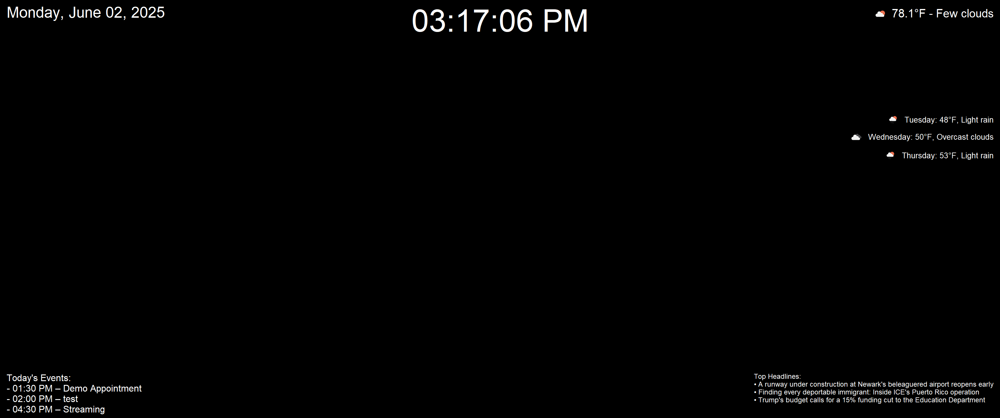

# Smart Mirror

A Python-based smart mirror interface built with `tkinter`. It displays the current time, date, weather (with icons), 3-day forecast, Google Calendar events, and NPR news headlines — all in a sleek fullscreen layout.  

This project was created by **Kevin Koch** as a personal coding warmup, with potential for real-world use. Feel free to explore, modify, or build your own version from this base!

---

## ✨ Features

- 🕒 Live time and date (auto-updating)
- 🌤 Current weather and 3-day forecast with icons (via OpenWeather API)
- 📅 Google Calendar integration for daily events
- 📰 NPR top 3 news headlines
- 🖥️ Fullscreen display, suitable for use on a Raspberry Pi-powered smart mirror

---

## 📸 Screenshot



---

## 🚀 Setup Instructions

### 1. Clone the repository

```bash
git clone https://github.com/yourusername/smart-mirror.git
cd smart-mirror
```

### 2. Create a virtual environment and activate it

```bash
python -m venv venv
# Windows
venv\Scripts\activate
# macOS/Linux
source venv/bin/activate
```

### 3. Install dependencies

```bash
pip install -r requirements.txt
```

### 4. Configure API keys

Create a folder called `config` and add the following:

#### `config/config.py`
```python
API_KEY = "your_openweather_api_key"
CITY = "your_city"
```

#### `config/credentials.json`
Your [Google Calendar OAuth credentials](https://developers.google.com/calendar/api/quickstart/python) go here.

---

## ⚠️ .gitignore

To protect sensitive info, this repo ignores:

```
config/
token.json
__pycache__/
venv/
*.pyc
```

---

## 🧪 Running the App

```bash
python main.py
```

It will launch in fullscreen. Press `Esc` to exit.

---

## 📝 License

This project is licensed under the [MIT License](LICENSE).

---

## 🙏 Credits

Created by [Kevin Koch](https://github.com/cptwalmart).

---

## 💡 Contributing

Pull requests and feedback are always welcome! Open an issue if you'd like to suggest an improvement or bug fix.
